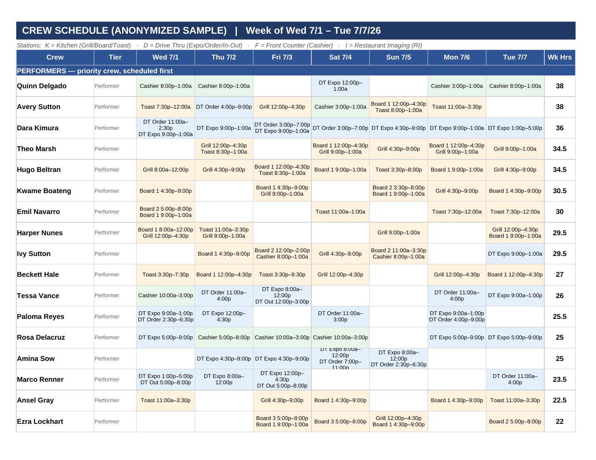

# crew-scheduling-engine

Constraint-based weekly crew scheduler and Excel workbook generator for a store in a national quick-service restaurant chain. Built by Sama Mushtaq, the restaurant manager who runs the schedule, as working ops tooling rather than a demo: the original versions of these scripts produced the store's actual posted schedule.

Published with the crew roster anonymized and corporate labor targets replaced with representative values. Details in "What is anonymized or redacted" below.



## What it does

Three files:

- `schedule_data.py` - the data. A 43-person roster with 7-day availability windows, solo-capable positions per person, weekly hour targets, and rule flags (closer, no-solo-close, exempt anchor, new hire, trainee, RI). Plus per-day, per-position demand windows for all 9 positions across kitchen, drive-thru, and front counter.
- `gen7_engine.py` - the scheduling engine. Splits demand windows into 5-hour-max slots, assigns crew slot by slot (close slots first, then peak, then longest), then runs escalating gap-fill passes and a rebalancing loop. Writes `assignF.json`, `hoursF.json`, `training.json` and prints diagnostics: uncovered demand, training-shadow checks, per-person hours vs target, and register/board concurrency violations.
- `build8_workbook_builder.py` - reads the engine's JSON output and renders an 11-tab Excel workbook with openpyxl: a grouped Schedule grid, seven per-day position coverage timelines, an hour-by-hour Coverage Check, an Hours Summary with a labor budget section, and a Notes and Decisions tab written for the leadership team.

`SCHEDULE_HANDOFF.md` is the actual working handoff document used to continue the build across AI sessions each week, kept as an artifact of the process (sanitized the same way as the code).

## Rules the engine encodes

House rules and operating constraints, all enforced in code:

- 8:00a floor: no shift starts before 8:00a.
- 3-hour minimum shift, one continuous shift per person per day (no splits).
- 5-hour position cap: nobody holds one position more than 5 hours; longer shifts rotate stations. A short list of exempt anchors may hold a station longer.
- No close-then-open: a closer (shift ends 1:00a) cannot open before 11:00a the next day.
- Concurrency limits: at most 2 registers and at most 3 boards staffed at any moment.
- Per-person close capability and no-solo-close flags.
- Trainee shadowing: every training block requires a Certified Trainer working the same position at the same time, weekdays only. Trainees are an extra body and never counted as coverage.
- Performance-priority tiers: performers are scheduled first and may run up to 12 hours over their weekly target; everyone else is a fill-in used only where performers cannot cover.
- Rebalancing: up to 400 iterations that move whole shifts from the most over-target performer to an under-target performer who can legally take them.
- Three escalating gap-fill passes after the main assignment: a relaxed hours-cap fill, an adjacency-preferring gap closer, and a last-resort force fill with a 1.5-hour minimum block.

## How to run

```
pip install openpyxl
python3 gen7_engine.py
python3 build8_workbook_builder.py
```

Run both from the repo root. The engine prints diagnostics and writes three JSON intermediates (gitignored, regenerated every run); the builder writes `sample_output/Crew_Schedule_SAMPLE.xlsx`.

The committed sample workbook was generated exactly this way from the anonymized data. On this dataset the engine reports 0.00 uncovered demand hours, every training block has a Certified Trainer on station, the register/board concurrency check passes, and total scheduled hours are 803.0.

## Sample output

`sample_output/Crew_Schedule_SAMPLE.xlsx` has 11 tabs:

1. Schedule - crew grid grouped by tier (Performers, Fill-ins, Trainees, RI), color-coded by station, with weekly hours. The screenshot above is the first page of this tab.
2. Wed 7-1 through Tue 7-7 (seven tabs) - per-day position coverage timelines: who is on each position each half hour, red for required-but-uncovered, purple for trainee shadows.
3. Coverage Check - scheduled bodies vs requirement per position per hour, all seven days.
4. Hours Summary - per-person daily and weekly hours vs target (live formulas), plus the daily labor budget section.
5. Notes and Decisions - the decision log handed to leadership with the schedule.

## What is anonymized or redacted

- Every crew name is a pseudonym, consistent across both scripts, the handoff document, and the sample workbook. The real roster is private.
- Manager names other than Sama are generic labels (Manager A through D).
- The labor Optimal/Target numbers (`OPT` and `TGT` in the workbook builder) and the weekly deployment total are representative round placeholders. The real values are the company's internal forecasts and are redacted; the code marks those lines with a comment.
- No original store documents or the posted schedule are included. The committed workbook is a fresh regeneration from the anonymized data.
- Everything else is real: availability shapes, demand windows, rules, priorities, and the engine logic itself.

## Limitations, stated plainly

- It is a greedy heuristic with local rebalancing, not an ILP or CP-SAT model. It produces a good feasible schedule quickly; it does not prove optimality.
- The roster and availability are hard-coded in `schedule_data.py`, transcribed weekly from HotSchedules screenshots. Changing the week means editing the data module.
- Single week, single store. Demand windows and workbook layout are tuned to this store's stations.
- Diagnostics are prints, not automated tests. Correctness was verified by the manager reading the diagnostics and the workbook's own coverage checks before posting each week.
- The original scripts were coupled by the builder exec-ing the top half of the engine file. The published version replaces that with the shared `schedule_data.py` module; the handoff document describes the original wiring.
- Built with AI assistance (Claude) as a coding partner. The rules, roster knowledge, priorities, and every acceptance decision came from the manager; the handoff document in this repo is the real artifact used to direct that collaboration.

## Related

`restaurant-imaging-program` (same portfolio) documents the Restaurant Imaging program behind the weekday 8:00a to 12:00p RI block that this engine carves out of production coverage.
